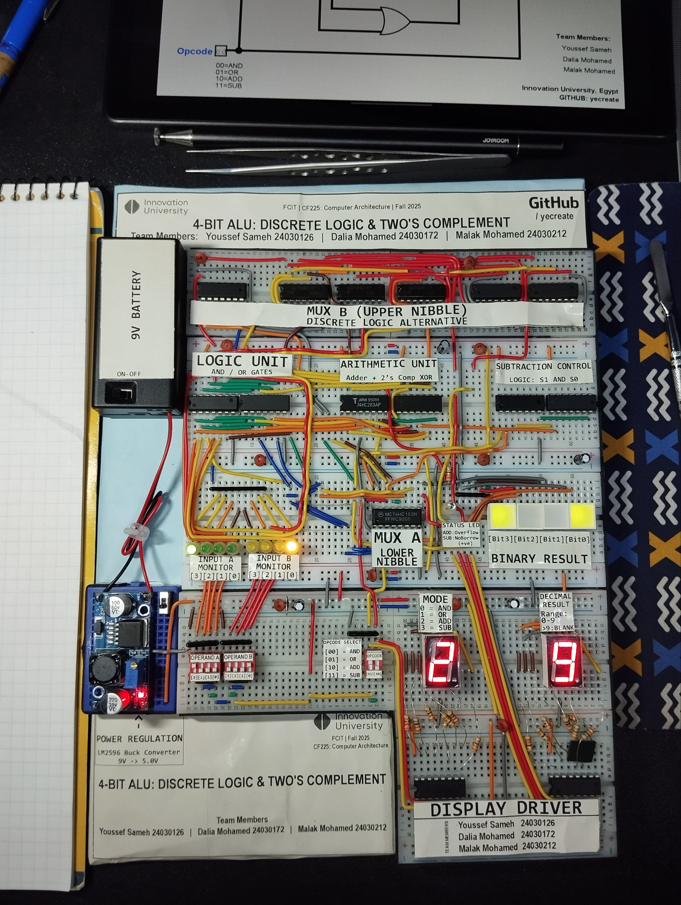
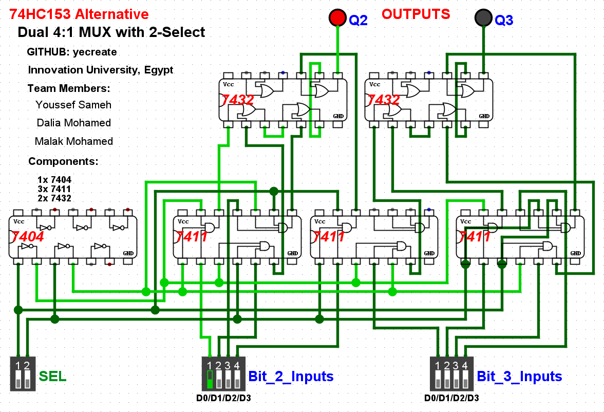

# 4-Bit Arithmetic Logic Unit (ALU) 🧮

A fully functional 4-bit ALU designed and built using **74HC-series discrete logic gates**. This project implements core CPU operations (ADD, SUB, AND, OR) with a hardware-based Two's Complement architecture for subtraction.

**Institution:** Innovation University, FCIT  
**Course:** CF225 Computer Architecture (Fall 2025)

---

## 📸 Hardware Preview

## 🚀 Features
* **4 Operations:** AND, OR, ADD, SUB (Selectable via 2-bit Opcode).
* **Two's Complement Subtraction:** Hardware implementation using XOR gates and Carry-In manipulation.
* **Hybrid Multiplexing:** A unique combination of MSI chips (74HC153) and discrete logic gates (74HC11/32/04) to route signals.
* **Visual Dashboard:** Real-time BCD output display (CD4511) and binary status LEDs.

## 🛠️ Hardware Specifications
| Unit | Components Used | Description |
| :--- | :--- | :--- |
| **Arithmetic** | 74HC283, 74HC86 | 4-Bit Adder with XOR-based inversion for subtraction. |
| **Logic** | 74HC08, 74HC32 | Quad AND / Quad OR gates. |
| **Control** | 74HC00, 74HC04 | Generates `SUB_Active` signal for mode switching. |
| **Muxing** | 74HC153 + Discrete | Routes the 4-bit result to the display. |
| **Power** | LM2596 | Regulates 9V battery input to a stable 5.0V. |

## 🧩 The "Hybrid Mux" Solution
Due to component availability constraints during the build phase, we engineered a custom discrete logic replacement for the upper-nibble multiplexer.
* **Problem:** Missing second 74HC153 IC.
* **Solution:** Designed a 4:1 Mux using **Triple 3-Input AND (74HC11)** and **OR (74HC32)** gates.
* **Outcome:** Successfully validated internal Mux logic and completed the routing path without the specific IC.

## ⚠️ Technical Notes
**The CD4511 Limitation:**
The display decoder is strictly BCD (0-9). Results from 10-15 (0xA - 0xF) trigger the chip's internal blanking state. This is a documented hardware constraint, not a wiring error.

## 👥 Team Members
* **Youssef Sameh** (24030126) - Hardware Design & Assembly
* **Dalia Mohamed** (24030172) - Verification & Simulation
* **Malak Mohamed** (24030212) - Documentation & Testing

## 📄 License

This project is open-source under the [MIT License](LICENSE).
